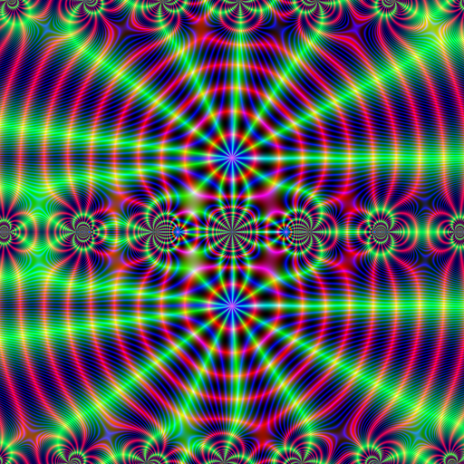

# Jacobi.jl documentation

Jacobi theta functions and related functions.


```julia
using Jacobi
using Images
# array of complex values.
z = (1:-0.001:-1) .* im .+ (-1:0.001:1)';
# function z->RGB 
function colormap(z)
    if isinf(z) || isnan(z)
        return RGB(0, 0, 0)
    end
    r = mod(abs(z), 1.0)
    g = 2 * mod(angle(z), 0.5)
    b = mod(real(z) * imag(z), 1.0)
    if isnan(b)
        return RGB(0, 0, 0)
    end
    return RGB(
        (1.0 - cos(r-0.5))*8.0,
        (1.0 - cos(g-0.5))*8.0,
        (1.0 - cos(b-0.5))*8.0
    )
end
# function to be plottes
function f(z)
    return Jacobi.wzeta(z; tau = 0.1 + 3im)
end
# raster image
image = colormap.(f(3*z))
```



```@contents
```

## Functions

```@docs
ljtheta1
jtheta1
ljtheta2
jtheta2
ljtheta3
jtheta3
ljtheta4
jtheta4
jtheta1dash
etaDedekind
lambda
kleinj
kleinjinv
CarlsonRF
CarlsonRD
ellipticF
ellipticK
ellipticE
agm
EisensteinE2
EisensteinE4
wp
wsigma
wzeta
```

## Index

```@index
```